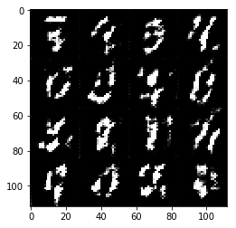
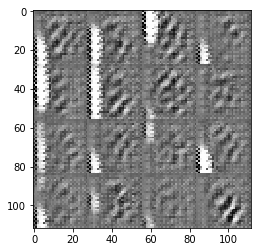
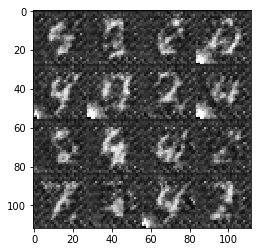
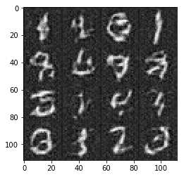
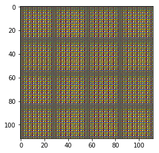
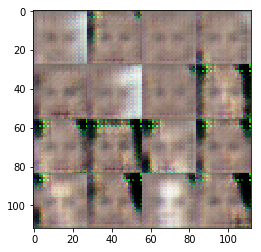
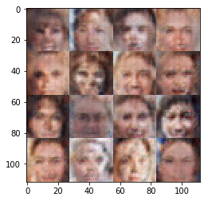
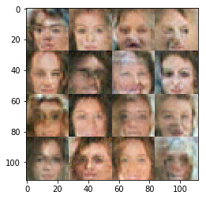

# Face Generation
In this project, you'll use generative adversarial networks to generate new images of faces.
### Get the Data
You'll be using two datasets in this project:
- MNIST
- CelebA

Since the celebA dataset is complex and you're doing GANs in a project for the first time, we want you to test your neural network on MNIST before CelebA.  Running the GANs on MNIST will allow you to see how well your model trains sooner.

If you're using [FloydHub](https://www.floydhub.com/), set `data_dir` to "/input" and use the [FloydHub data ID](http://docs.floydhub.com/home/using_datasets/) "R5KrjnANiKVhLWAkpXhNBe".


```python
data_dir = './data'

# FloydHub - Use with data ID "R5KrjnANiKVhLWAkpXhNBe"
#data_dir = '/input'


"""
DON'T MODIFY ANYTHING IN THIS CELL
"""
import helper

helper.download_extract('mnist', data_dir)
helper.download_extract('celeba', data_dir)
```

    Downloading mnist: 9.92MB [00:10, 987KB/s]                             
    Extracting mnist: 100%|██████████| 60.0K/60.0K [00:07<00:00, 8.37KFile/s]
    Downloading celeba: 1.44GB [29:23, 819KB/s]                            


    Extracting celeba...


## Explore the Data
### MNIST
As you're aware, the [MNIST](http://yann.lecun.com/exdb/mnist/) dataset contains images of handwritten digits. You can view the first number of examples by changing `show_n_images`. 


```python
import helper

show_n_images = 25
data_dir = './data'

"""
DON'T MODIFY ANYTHING IN THIS CELL
"""
%matplotlib inline
import os
from glob import glob
from matplotlib import pyplot

mnist_images = helper.get_batch(glob(os.path.join(data_dir, 'mnist/*.jpg'))[:show_n_images], 28, 28, 'L')
pyplot.imshow(helper.images_square_grid(mnist_images, 'L'), cmap='gray')
```


    <matplotlib.image.AxesImage at 0x7f3ecaa7fb00>


### CelebA
The [CelebFaces Attributes Dataset (CelebA)](http://mmlab.ie.cuhk.edu.hk/projects/CelebA.html) dataset contains over 200,000 celebrity images with annotations.  Since you're going to be generating faces, you won't need the annotations.  You can view the first number of examples by changing `show_n_images`.


```python
show_n_images = 25

"""
DON'T MODIFY ANYTHING IN THIS CELL
"""
mnist_images = helper.get_batch(glob(os.path.join(data_dir, 'img_align_celeba/*.jpg'))[:show_n_images], 28, 28, 'RGB')
pyplot.imshow(helper.images_square_grid(mnist_images, 'RGB'))
```


    <matplotlib.image.AxesImage at 0x7f3ec7884cc0>


## Preprocess the Data
Since the project's main focus is on building the GANs, we'll preprocess the data for you.  The values of the MNIST and CelebA dataset will be in the range of -0.5 to 0.5 of 28x28 dimensional images.  The CelebA images will be cropped to remove parts of the image that don't include a face, then resized down to 28x28.

The MNIST images are black and white images with a single [color channel](https://en.wikipedia.org/wiki/Channel_(digital_image%29) while the CelebA images have [3 color channels (RGB color channel)](https://en.wikipedia.org/wiki/Channel_(digital_image%29#RGB_Images).
## Build the Neural Network
You'll build the components necessary to build a GANs by implementing the following functions below:
- `model_inputs`
- `discriminator`
- `generator`
- `model_loss`
- `model_opt`
- `train`

### Check the Version of TensorFlow and Access to GPU
This will check to make sure you have the correct version of TensorFlow and access to a GPU


```python
"""
DON'T MODIFY ANYTHING IN THIS CELL
"""
from distutils.version import LooseVersion
import warnings
import tensorflow as tf

# Check TensorFlow Version
assert LooseVersion(tf.__version__) >= LooseVersion('1.0'), 'Please use TensorFlow version 1.0 or newer.  You are using {}'.format(tf.__version__)
print('TensorFlow Version: {}'.format(tf.__version__))

# Check for a GPU
if not tf.test.gpu_device_name():
    warnings.warn('No GPU found. Please use a GPU to train your neural network.')
else:
    print('Default GPU Device: {}'.format(tf.test.gpu_device_name()))
```

    TensorFlow Version: 1.3.0


    /home/aladim/anaconda3/envs/dlnd-tf-lab/lib/python3.5/site-packages/ipykernel/__main__.py:14: UserWarning: No GPU found. Please use a GPU to train your neural network.


### Input
Implement the `model_inputs` function to create TF Placeholders for the Neural Network. It should create the following placeholders:
- Real input images placeholder with rank 4 using `image_width`, `image_height`, and `image_channels`.
- Z input placeholder with rank 2 using `z_dim`.
- Learning rate placeholder with rank 0.

Return the placeholders in the following the tuple (tensor of real input images, tensor of z data)


```python
import problem_unittests as tests

def model_inputs(image_width, image_height, image_channels, z_dim):
    """
    Create the model inputs
    :param image_width: The input image width
    :param image_height: The input image height
    :param image_channels: The number of image channels
    :param z_dim: The dimension of Z
    :return: Tuple of (tensor of real input images, tensor of z data, learning rate)
    """
    real_input = tf.placeholder(tf.float32, [None, image_height, image_width, image_channels], name='real_input')
    z_input = tf.placeholder(tf.float32, [None, z_dim], name='z_input')
    learning_rate = tf.placeholder(tf.float32, name='learning_rate', shape=())
    
    return real_input, z_input, learning_rate


"""
DON'T MODIFY ANYTHING IN THIS CELL THAT IS BELOW THIS LINE
"""
tests.test_model_inputs(model_inputs)
```

    Tests Passed


### Discriminator
Implement `discriminator` to create a discriminator neural network that discriminates on `images`.  This function should be able to reuse the variables in the neural network.  Use [`tf.variable_scope`](https://www.tensorflow.org/api_docs/python/tf/variable_scope) with a scope name of "discriminator" to allow the variables to be reused.  The function should return a tuple of (tensor output of the discriminator, tensor logits of the discriminator).


```python
def discriminator(images, reuse=False, alpha=0.2):
    """
    Create the discriminator network
    :param images: Tensor of input image(s)
    :param reuse: Boolean if the weights should be reused
    :return: Tuple of (tensor output of the discriminator, tensor logits of the discriminator)
    """
    #https://medium.com/towards-data-science/gan-by-example-using-keras-on-tensorflow-backend-1a6d515a60d0
    with tf.variable_scope("discriminator", reuse=reuse):
        out1 = tf.layers.conv2d(images, 64, 5, strides=2, padding='SAME')
        relu1 = tf.maximum(alpha * out1, out1)
        drop1 = tf.layers.dropout(relu1, rate=0.4)
        
        out2 = tf.layers.conv2d(drop1, 128, 5, strides=2, padding='SAME')
        norm2 = tf.layers.batch_normalization(out2, training=True)
        relu2 = tf.maximum(alpha * norm2, norm2)
        drop2 = tf.layers.dropout(relu2, rate=0.4)
        
        out3 = tf.layers.conv2d(drop2, 256, 5, strides=2, padding='SAME')
        norm3 = tf.layers.batch_normalization(out3, training=True)
        relu3 = tf.maximum(alpha * norm3, norm3)
        drop3 = tf.layers.dropout(relu3, rate=0.4)
        
        flat = tf.reshape(drop3, (-1, 4*4*256))
        logits = tf.layers.dense(flat, 1)
        output = tf.sigmoid(logits)

    return output, logits


"""
DON'T MODIFY ANYTHING IN THIS CELL THAT IS BELOW THIS LINE
"""
tests.test_discriminator(discriminator, tf)
```

    Tests Passed


### Generator
Implement `generator` to generate an image using `z`. This function should be able to reuse the variables in the neural network.  Use [`tf.variable_scope`](https://www.tensorflow.org/api_docs/python/tf/variable_scope) with a scope name of "generator" to allow the variables to be reused. The function should return the generated 28 x 28 x `out_channel_dim` images.


```python
def generator(z, out_channel_dim, is_train=True, alpha=0.2):
    """
    Create the generator network
    :param z: Input z
    :param out_channel_dim: The number of channels in the output image
    :param is_train: Boolean if generator is being used for training
    :return: The tensor output of the generator
    """
    #https://medium.com/towards-data-science/gan-by-example-using-keras-on-tensorflow-backend-1a6d515a60d0
    reuse = not is_train
    
    with tf.variable_scope("generator", reuse=reuse):
        out1 = tf.layers.dense(z, 7*7*512)
        
        out1 = tf.reshape(out1, (-1, 7, 7, 512))
        norm1 = tf.layers.batch_normalization(out1, training=is_train, momentum=0.9)
        relu1 = tf.maximum(alpha * norm1, norm1)
        drop1 = tf.layers.dropout(relu1)
        
        out2 = tf.layers.conv2d_transpose(drop1, 256, 5, strides=2, padding='SAME')
        norm2 = tf.layers.batch_normalization(out2, training=is_train, momentum=0.9)
        relu2 = tf.maximum(alpha * norm2, norm2)

        out3 = tf.layers.conv2d_transpose(relu2, 128, 5, strides=2, padding='SAME')
        norm3 = tf.layers.batch_normalization(out3, training=is_train, momentum=0.9)
        relu3 = tf.maximum(alpha * norm3, norm3)
        
        logits = tf.layers.conv2d_transpose(relu3, out_channel_dim, 5, strides=1, padding='SAME')
        output = tf.tanh(logits)
        
    return output


"""
DON'T MODIFY ANYTHING IN THIS CELL THAT IS BELOW THIS LINE
"""
tests.test_generator(generator, tf)
```

    Tests Passed


### Loss
Implement `model_loss` to build the GANs for training and calculate the loss.  The function should return a tuple of (discriminator loss, generator loss).  Use the following functions you implemented:
- `discriminator(images, reuse=False)`
- `generator(z, out_channel_dim, is_train=True)`


```python
def model_loss(input_real, input_z, out_channel_dim):
    """
    Get the loss for the discriminator and generator
    :param input_real: Images from the real dataset
    :param input_z: Z input
    :param out_channel_dim: The number of channels in the output image
    :return: A tuple of (discriminator loss, generator loss)
    """
    #base on DCGAN.ipynb
    ger_model = generator(input_z, out_channel_dim)
    dis_model_real, dis_logits_real = discriminator(input_real)
    dis_model_fake, dis_logits_fake = discriminator(ger_model, reuse=True)
    
    dis_loss_real = tf.reduce_mean(
        tf.nn.sigmoid_cross_entropy_with_logits(logits=dis_logits_real, labels=tf.ones_like(dis_model_real) * 0.9))
    dis_loss_fake = tf.reduce_mean(
        tf.nn.sigmoid_cross_entropy_with_logits(logits=dis_logits_fake, labels=tf.zeros_like(dis_model_fake)))
    ger_loss = tf.reduce_mean(
        tf.nn.sigmoid_cross_entropy_with_logits(logits=dis_logits_fake, labels=tf.ones_like(dis_model_fake)))
    
    dis_loss = dis_loss_real + dis_loss_fake
    
    return dis_loss, ger_loss


"""
DON'T MODIFY ANYTHING IN THIS CELL THAT IS BELOW THIS LINE
"""
tests.test_model_loss(model_loss)
```

    Tests Passed


### Optimization
Implement `model_opt` to create the optimization operations for the GANs. Use [`tf.trainable_variables`](https://www.tensorflow.org/api_docs/python/tf/trainable_variables) to get all the trainable variables.  Filter the variables with names that are in the discriminator and generator scope names.  The function should return a tuple of (discriminator training operation, generator training operation).


```python
def model_opt(d_loss, g_loss, learning_rate, beta1):
    """
    Get optimization operations
    :param d_loss: Discriminator loss Tensor
    :param g_loss: Generator loss Tensor
    :param learning_rate: Learning Rate Placeholder
    :param beta1: The exponential decay rate for the 1st moment in the optimizer
    :return: A tuple of (discriminator training operation, generator training operation)
    """
    with tf.control_dependencies(tf.get_collection(tf.GraphKeys.UPDATE_OPS)):
        train_vars = tf.trainable_variables()
        
        dis_vars = [var for var in train_vars if var.name.startswith("discriminator")]
        ger_vars = [var for var in train_vars if var.name.startswith("generator")]

        dis_train = tf.train.AdamOptimizer(learning_rate, beta1=beta1).minimize(d_loss, var_list=dis_vars)
        ger_train = tf.train.AdamOptimizer(learning_rate, beta1=beta1).minimize(g_loss, var_list=ger_vars)
        
    return dis_train, ger_train


"""
DON'T MODIFY ANYTHING IN THIS CELL THAT IS BELOW THIS LINE
"""
tests.test_model_opt(model_opt, tf)
```

    Tests Passed


## Neural Network Training
### Show Output
Use this function to show the current output of the generator during training. It will help you determine how well the GANs is training.


```python
"""
DON'T MODIFY ANYTHING IN THIS CELL
"""
import numpy as np

def show_generator_output(sess, n_images, input_z, out_channel_dim, image_mode):
    """
    Show example output for the generator
    :param sess: TensorFlow session
    :param n_images: Number of Images to display
    :param input_z: Input Z Tensor
    :param out_channel_dim: The number of channels in the output image
    :param image_mode: The mode to use for images ("RGB" or "L")
    """
    cmap = None if image_mode == 'RGB' else 'gray'
    z_dim = input_z.get_shape().as_list()[-1]
    example_z = np.random.uniform(-1, 1, size=[n_images, z_dim])

    samples = sess.run(
        generator(input_z, out_channel_dim, False),
        feed_dict={input_z: example_z})

    images_grid = helper.images_square_grid(samples, image_mode)
    pyplot.imshow(images_grid, cmap=cmap)
    pyplot.show()
```

### Train
Implement `train` to build and train the GANs.  Use the following functions you implemented:
- `model_inputs(image_width, image_height, image_channels, z_dim)`
- `model_loss(input_real, input_z, out_channel_dim)`
- `model_opt(d_loss, g_loss, learning_rate, beta1)`

Use the `show_generator_output` to show `generator` output while you train. Running `show_generator_output` for every batch will drastically increase training time and increase the size of the notebook.  It's recommended to print the `generator` output every 100 batches.


```python
def train(epoch_count, batch_size, z_dim, learning_rate, beta1, get_batches, data_shape, data_image_mode):
    """
    Train the GAN
    :param epoch_count: Number of epochs
    :param batch_size: Batch Size
    :param z_dim: Z dimension
    :param learning_rate: Learning Rate
    :param beta1: The exponential decay rate for the 1st moment in the optimizer
    :param get_batches: Function to get batches
    :param data_shape: Shape of the data
    :param data_image_mode: The image mode to use for images ("RGB" or "L")
    """
    #based on DCGAN.ipynb
    output_channel_dim = data_shape[3]
    real_input, z_input, tf_learnrate = model_inputs(data_shape[1], data_shape[2], output_channel_dim, z_dim)
    d_loss, g_loss = model_loss(real_input, z_input, output_channel_dim)
    dis_train, ger_train = model_opt(d_loss, g_loss, learning_rate, beta1)
    
    with tf.Session() as sess:
        sess.run(tf.global_variables_initializer())
        for epoch_i in range(epoch_count):
            for step, batch_images in enumerate(get_batches(batch_size)):
                
                batch_z = np.random.uniform(-1, 1, size=(batch_size, z_dim))
                _ = sess.run(dis_train, feed_dict={real_input: batch_images, z_input: batch_z, tf_learnrate: learning_rate})
                _ = sess.run(ger_train, feed_dict={z_input: batch_z, real_input: batch_images, tf_learnrate: learning_rate})
                
                if step % 10 == 0:
                    train_loss_dis = d_loss.eval({z_input: batch_z, real_input: batch_images})
                    train_loss_ger = g_loss.eval({z_input: batch_z})
                
                    print("Epoch {}/{}...".format(epoch_i+1, epochs),
                          "Discriminator Loss: {:.4f}...".format(train_loss_dis),
                          "Generator Loss: {:.4f}".format(train_loss_ger))
                
                number_of_images = 16
                if step % 100 == 0:
                    show_generator_output(sess, number_of_images, z_input, output_channel_dim, data_image_mode)
                    
```

### MNIST
Test your GANs architecture on MNIST.  After 2 epochs, the GANs should be able to generate images that look like handwritten digits.  Make sure the loss of the generator is lower than the loss of the discriminator or close to 0.


```python
batch_size = 64
z_dim = 120
learning_rate = 0.001
beta1 = 0.4

"""
DON'T MODIFY ANYTHING IN THIS CELL THAT IS BELOW THIS LINE
"""
epochs = 2

mnist_dataset = helper.Dataset('mnist', glob(os.path.join(data_dir, 'mnist/*.jpg')))
with tf.Graph().as_default():
    train(epochs, batch_size, z_dim, learning_rate, beta1, mnist_dataset.get_batches,
          mnist_dataset.shape, mnist_dataset.image_mode)
```

    Epoch 1/2... Discriminator Loss: 18.6717... Generator Loss: 0.0000


    Epoch 1/2... Discriminator Loss: 0.4182... Generator Loss: 5.4010
    Epoch 1/2... Discriminator Loss: 0.5502... Generator Loss: 3.8693
    Epoch 1/2... Discriminator Loss: 2.5287... Generator Loss: 0.4858
    Epoch 1/2... Discriminator Loss: 1.8277... Generator Loss: 5.3548
    Epoch 1/2... Discriminator Loss: 0.8926... Generator Loss: 4.6513
    Epoch 1/2... Discriminator Loss: 0.9006... Generator Loss: 2.6375
    Epoch 1/2... Discriminator Loss: 2.3992... Generator Loss: 0.2634
    Epoch 1/2... Discriminator Loss: 1.0552... Generator Loss: 0.9195
    Epoch 1/2... Discriminator Loss: 1.1696... Generator Loss: 0.7578
    Epoch 1/2... Discriminator Loss: 0.3840... Generator Loss: 3.4520





    Epoch 1/2... Discriminator Loss: 0.3599... Generator Loss: 3.9124
    Epoch 1/2... Discriminator Loss: 0.3512... Generator Loss: 4.6893
    Epoch 1/2... Discriminator Loss: 0.3758... Generator Loss: 3.6980
    Epoch 1/2... Discriminator Loss: 1.8100... Generator Loss: 13.6448
    Epoch 1/2... Discriminator Loss: 1.0764... Generator Loss: 1.9677
    Epoch 1/2... Discriminator Loss: 0.4542... Generator Loss: 2.4665
    Epoch 1/2... Discriminator Loss: 0.4922... Generator Loss: 2.2867
    Epoch 1/2... Discriminator Loss: 0.4226... Generator Loss: 2.9377
    Epoch 1/2... Discriminator Loss: 0.4306... Generator Loss: 5.9017
    Epoch 1/2... Discriminator Loss: 1.0487... Generator Loss: 5.5744


    Epoch 1/2... Discriminator Loss: 0.8089... Generator Loss: 1.7625
    Epoch 1/2... Discriminator Loss: 0.3768... Generator Loss: 3.9536
    Epoch 1/2... Discriminator Loss: 0.7475... Generator Loss: 1.3577
    Epoch 1/2... Discriminator Loss: 3.8744... Generator Loss: 0.0513
    Epoch 1/2... Discriminator Loss: 0.5434... Generator Loss: 2.2639
    Epoch 1/2... Discriminator Loss: 0.3541... Generator Loss: 4.6484
    Epoch 1/2... Discriminator Loss: 0.3653... Generator Loss: 3.8274
    Epoch 1/2... Discriminator Loss: 0.3676... Generator Loss: 4.0002
    Epoch 1/2... Discriminator Loss: 0.3420... Generator Loss: 5.6996
    Epoch 1/2... Discriminator Loss: 0.3730... Generator Loss: 3.9811





    Epoch 1/2... Discriminator Loss: 0.3602... Generator Loss: 4.3106
    Epoch 1/2... Discriminator Loss: 0.3348... Generator Loss: 6.3144
    Epoch 1/2... Discriminator Loss: 0.3381... Generator Loss: 5.8347
    Epoch 1/2... Discriminator Loss: 0.4491... Generator Loss: 3.0344
    Epoch 1/2... Discriminator Loss: 1.0345... Generator Loss: 2.4311
    Epoch 1/2... Discriminator Loss: 0.4815... Generator Loss: 2.3211
    Epoch 1/2... Discriminator Loss: 0.5177... Generator Loss: 2.4768
    Epoch 1/2... Discriminator Loss: 0.4458... Generator Loss: 2.6330
    Epoch 1/2... Discriminator Loss: 0.4242... Generator Loss: 3.3447
    Epoch 1/2... Discriminator Loss: 0.3531... Generator Loss: 4.6426


    Epoch 1/2... Discriminator Loss: 0.3616... Generator Loss: 4.4722
    Epoch 1/2... Discriminator Loss: 0.3459... Generator Loss: 4.6947
    Epoch 1/2... Discriminator Loss: 0.5252... Generator Loss: 2.3503
    Epoch 1/2... Discriminator Loss: 1.0485... Generator Loss: 0.9695
    Epoch 1/2... Discriminator Loss: 0.4492... Generator Loss: 2.8366
    Epoch 1/2... Discriminator Loss: 0.5840... Generator Loss: 2.0724
    Epoch 1/2... Discriminator Loss: 1.4424... Generator Loss: 0.7796
    Epoch 1/2... Discriminator Loss: 0.4100... Generator Loss: 3.2667
    Epoch 1/2... Discriminator Loss: 0.3938... Generator Loss: 3.4847
    Epoch 1/2... Discriminator Loss: 0.3661... Generator Loss: 4.3388


    Epoch 1/2... Discriminator Loss: 0.3756... Generator Loss: 3.4295
    Epoch 1/2... Discriminator Loss: 0.3465... Generator Loss: 5.4740
    Epoch 1/2... Discriminator Loss: 0.4399... Generator Loss: 3.1219
    Epoch 1/2... Discriminator Loss: 0.3598... Generator Loss: 4.8762
    Epoch 1/2... Discriminator Loss: 0.3438... Generator Loss: 4.9415
    Epoch 1/2... Discriminator Loss: 0.8032... Generator Loss: 1.4147
    Epoch 1/2... Discriminator Loss: 0.5313... Generator Loss: 2.0023
    Epoch 1/2... Discriminator Loss: 0.8670... Generator Loss: 1.2045
    Epoch 1/2... Discriminator Loss: 0.3639... Generator Loss: 4.7771
    Epoch 1/2... Discriminator Loss: 0.3890... Generator Loss: 3.8282


    Epoch 1/2... Discriminator Loss: 0.3546... Generator Loss: 4.8946
    Epoch 1/2... Discriminator Loss: 0.3813... Generator Loss: 4.0568
    Epoch 1/2... Discriminator Loss: 0.4180... Generator Loss: 3.5312
    Epoch 1/2... Discriminator Loss: 0.3796... Generator Loss: 3.6899
    Epoch 1/2... Discriminator Loss: 0.3417... Generator Loss: 6.1360
    Epoch 1/2... Discriminator Loss: 0.4190... Generator Loss: 4.2490
    Epoch 1/2... Discriminator Loss: 0.7814... Generator Loss: 1.7616
    Epoch 1/2... Discriminator Loss: 0.6529... Generator Loss: 1.7923
    Epoch 1/2... Discriminator Loss: 1.9452... Generator Loss: 0.3138
    Epoch 1/2... Discriminator Loss: 3.1307... Generator Loss: 6.5337


    Epoch 1/2... Discriminator Loss: 1.1457... Generator Loss: 0.8600
    Epoch 1/2... Discriminator Loss: 1.0381... Generator Loss: 0.9395
    Epoch 1/2... Discriminator Loss: 0.9353... Generator Loss: 1.3483
    Epoch 1/2... Discriminator Loss: 1.1974... Generator Loss: 0.7285
    Epoch 1/2... Discriminator Loss: 0.8211... Generator Loss: 1.4197
    Epoch 1/2... Discriminator Loss: 0.4267... Generator Loss: 3.5431
    Epoch 1/2... Discriminator Loss: 0.4890... Generator Loss: 2.9137
    Epoch 1/2... Discriminator Loss: 0.5052... Generator Loss: 2.6867
    Epoch 1/2... Discriminator Loss: 0.8103... Generator Loss: 1.6982
    Epoch 1/2... Discriminator Loss: 0.3705... Generator Loss: 3.9992


    Epoch 1/2... Discriminator Loss: 0.3407... Generator Loss: 5.6875
    Epoch 1/2... Discriminator Loss: 0.3382... Generator Loss: 6.5280
    Epoch 1/2... Discriminator Loss: 0.3348... Generator Loss: 6.1485
    Epoch 1/2... Discriminator Loss: 0.3761... Generator Loss: 4.1083
    Epoch 1/2... Discriminator Loss: 0.4692... Generator Loss: 4.1876
    Epoch 1/2... Discriminator Loss: 2.6886... Generator Loss: 0.2368
    Epoch 1/2... Discriminator Loss: 1.0609... Generator Loss: 0.8563
    Epoch 1/2... Discriminator Loss: 0.3855... Generator Loss: 4.3281
    Epoch 1/2... Discriminator Loss: 0.3904... Generator Loss: 3.5950
    Epoch 1/2... Discriminator Loss: 0.3732... Generator Loss: 3.9224





    Epoch 1/2... Discriminator Loss: 0.3824... Generator Loss: 3.4892
    Epoch 1/2... Discriminator Loss: 0.3867... Generator Loss: 3.6330
    Epoch 1/2... Discriminator Loss: 0.3943... Generator Loss: 3.3863
    Epoch 2/2... Discriminator Loss: 0.3965... Generator Loss: 3.0795


    Epoch 2/2... Discriminator Loss: 0.7102... Generator Loss: 1.4361
    Epoch 2/2... Discriminator Loss: 1.0154... Generator Loss: 0.9626
    Epoch 2/2... Discriminator Loss: 0.7469... Generator Loss: 1.4369
    Epoch 2/2... Discriminator Loss: 1.1681... Generator Loss: 2.0524
    Epoch 2/2... Discriminator Loss: 1.1991... Generator Loss: 1.5846
    Epoch 2/2... Discriminator Loss: 0.8589... Generator Loss: 1.2165
    Epoch 2/2... Discriminator Loss: 0.7521... Generator Loss: 1.9398
    Epoch 2/2... Discriminator Loss: 0.7761... Generator Loss: 1.7488
    Epoch 2/2... Discriminator Loss: 0.8681... Generator Loss: 2.0295
    Epoch 2/2... Discriminator Loss: 0.5564... Generator Loss: 2.0787


    Epoch 2/2... Discriminator Loss: 0.4697... Generator Loss: 2.6957
    Epoch 2/2... Discriminator Loss: 2.6558... Generator Loss: 0.2100
    Epoch 2/2... Discriminator Loss: 1.6860... Generator Loss: 4.6695
    Epoch 2/2... Discriminator Loss: 2.6098... Generator Loss: 0.1531
    Epoch 2/2... Discriminator Loss: 0.6208... Generator Loss: 1.7633
    Epoch 2/2... Discriminator Loss: 1.6462... Generator Loss: 0.4267
    Epoch 2/2... Discriminator Loss: 0.6228... Generator Loss: 1.5984
    Epoch 2/2... Discriminator Loss: 0.3476... Generator Loss: 4.7067
    Epoch 2/2... Discriminator Loss: 0.9579... Generator Loss: 5.3597
    Epoch 2/2... Discriminator Loss: 1.3648... Generator Loss: 0.5318


    Epoch 2/2... Discriminator Loss: 0.7040... Generator Loss: 1.6138
    Epoch 2/2... Discriminator Loss: 1.9659... Generator Loss: 0.3582
    Epoch 2/2... Discriminator Loss: 0.7640... Generator Loss: 1.7513
    Epoch 2/2... Discriminator Loss: 0.6450... Generator Loss: 5.3566
    Epoch 2/2... Discriminator Loss: 0.4613... Generator Loss: 2.2868
    Epoch 2/2... Discriminator Loss: 0.3765... Generator Loss: 3.7113
    Epoch 2/2... Discriminator Loss: 0.3927... Generator Loss: 3.1346
    Epoch 2/2... Discriminator Loss: 0.3984... Generator Loss: 2.9488
    Epoch 2/2... Discriminator Loss: 0.7527... Generator Loss: 4.2758
    Epoch 2/2... Discriminator Loss: 0.8651... Generator Loss: 1.1340


    Epoch 2/2... Discriminator Loss: 0.7910... Generator Loss: 1.3059
    Epoch 2/2... Discriminator Loss: 0.5886... Generator Loss: 1.7250
    Epoch 2/2... Discriminator Loss: 0.4949... Generator Loss: 2.0770
    Epoch 2/2... Discriminator Loss: 1.6658... Generator Loss: 2.2604
    Epoch 2/2... Discriminator Loss: 1.0740... Generator Loss: 0.7839
    Epoch 2/2... Discriminator Loss: 0.4067... Generator Loss: 2.9264
    Epoch 2/2... Discriminator Loss: 0.4505... Generator Loss: 2.6708
    Epoch 2/2... Discriminator Loss: 0.4144... Generator Loss: 3.3963
    Epoch 2/2... Discriminator Loss: 0.4342... Generator Loss: 2.8453
    Epoch 2/2... Discriminator Loss: 0.3585... Generator Loss: 4.7025


    Epoch 2/2... Discriminator Loss: 0.3566... Generator Loss: 6.4329
    Epoch 2/2... Discriminator Loss: 0.3680... Generator Loss: 3.6437
    Epoch 2/2... Discriminator Loss: 0.3789... Generator Loss: 3.3137
    Epoch 2/2... Discriminator Loss: 0.3727... Generator Loss: 3.4362
    Epoch 2/2... Discriminator Loss: 0.7143... Generator Loss: 1.2806
    Epoch 2/2... Discriminator Loss: 0.7301... Generator Loss: 1.7697
    Epoch 2/2... Discriminator Loss: 1.0327... Generator Loss: 0.8601
    Epoch 2/2... Discriminator Loss: 0.5668... Generator Loss: 1.9329
    Epoch 2/2... Discriminator Loss: 1.6047... Generator Loss: 0.4591
    Epoch 2/2... Discriminator Loss: 0.8521... Generator Loss: 1.3014





    Epoch 2/2... Discriminator Loss: 0.8380... Generator Loss: 1.5031
    Epoch 2/2... Discriminator Loss: 0.7686... Generator Loss: 1.1990
    Epoch 2/2... Discriminator Loss: 0.6808... Generator Loss: 1.8939
    Epoch 2/2... Discriminator Loss: 0.3634... Generator Loss: 3.9626
    Epoch 2/2... Discriminator Loss: 0.4074... Generator Loss: 2.8265
    Epoch 2/2... Discriminator Loss: 0.3841... Generator Loss: 3.2756
    Epoch 2/2... Discriminator Loss: 1.0557... Generator Loss: 3.5570
    Epoch 2/2... Discriminator Loss: 0.3721... Generator Loss: 3.9502
    Epoch 2/2... Discriminator Loss: 0.3895... Generator Loss: 3.4009
    Epoch 2/2... Discriminator Loss: 0.4426... Generator Loss: 2.4536


    Epoch 2/2... Discriminator Loss: 0.4687... Generator Loss: 3.9043
    Epoch 2/2... Discriminator Loss: 0.3703... Generator Loss: 3.5054
    Epoch 2/2... Discriminator Loss: 0.4134... Generator Loss: 2.9185
    Epoch 2/2... Discriminator Loss: 0.3662... Generator Loss: 4.3022
    Epoch 2/2... Discriminator Loss: 1.0905... Generator Loss: 0.9541
    Epoch 2/2... Discriminator Loss: 0.7997... Generator Loss: 1.1213
    Epoch 2/2... Discriminator Loss: 0.4672... Generator Loss: 2.3155
    Epoch 2/2... Discriminator Loss: 1.3921... Generator Loss: 0.6333
    Epoch 2/2... Discriminator Loss: 0.8824... Generator Loss: 1.1121
    Epoch 2/2... Discriminator Loss: 0.8082... Generator Loss: 1.4365


    Epoch 2/2... Discriminator Loss: 0.9593... Generator Loss: 0.9929
    Epoch 2/2... Discriminator Loss: 0.8672... Generator Loss: 1.1660
    Epoch 2/2... Discriminator Loss: 0.5292... Generator Loss: 1.9798
    Epoch 2/2... Discriminator Loss: 0.3607... Generator Loss: 4.6074
    Epoch 2/2... Discriminator Loss: 0.4110... Generator Loss: 2.8145
    Epoch 2/2... Discriminator Loss: 1.2695... Generator Loss: 2.6994
    Epoch 2/2... Discriminator Loss: 1.6060... Generator Loss: 0.3972
    Epoch 2/2... Discriminator Loss: 1.8267... Generator Loss: 3.8771
    Epoch 2/2... Discriminator Loss: 1.5771... Generator Loss: 0.4395
    Epoch 2/2... Discriminator Loss: 1.2329... Generator Loss: 3.3491


    Epoch 2/2... Discriminator Loss: 0.5673... Generator Loss: 3.4825
    Epoch 2/2... Discriminator Loss: 1.2626... Generator Loss: 0.6115
    Epoch 2/2... Discriminator Loss: 0.6627... Generator Loss: 4.9761
    Epoch 2/2... Discriminator Loss: 1.6572... Generator Loss: 0.4004
    Epoch 2/2... Discriminator Loss: 0.5135... Generator Loss: 2.3783
    Epoch 2/2... Discriminator Loss: 0.7756... Generator Loss: 1.3495
    Epoch 2/2... Discriminator Loss: 0.7779... Generator Loss: 1.2754
    Epoch 2/2... Discriminator Loss: 0.4645... Generator Loss: 2.7426
    Epoch 2/2... Discriminator Loss: 0.5808... Generator Loss: 1.6837
    Epoch 2/2... Discriminator Loss: 1.0099... Generator Loss: 0.8318


    Epoch 2/2... Discriminator Loss: 0.8194... Generator Loss: 1.3862
    Epoch 2/2... Discriminator Loss: 0.4782... Generator Loss: 2.3555
    Epoch 2/2... Discriminator Loss: 0.3647... Generator Loss: 3.8309


### CelebA
Run your GANs on CelebA.  It will take around 20 minutes on the average GPU to run one epoch.  You can run the whole epoch or stop when it starts to generate realistic faces.


```python
batch_size = 64
z_dim = 120
learning_rate = 0.001
beta1 = 0.4

"""
DON'T MODIFY ANYTHING IN THIS CELL THAT IS BELOW THIS LINE
"""
epochs = 1

celeba_dataset = helper.Dataset('celeba', glob(os.path.join(data_dir, 'img_align_celeba/*.jpg')))
with tf.Graph().as_default():
    train(epochs, batch_size, z_dim, learning_rate, beta1, celeba_dataset.get_batches,
          celeba_dataset.shape, celeba_dataset.image_mode)
```

    Epoch 1/1... Discriminator Loss: 13.7246... Generator Loss: 0.0000





    Epoch 1/1... Discriminator Loss: 0.3975... Generator Loss: 4.0804
    Epoch 1/1... Discriminator Loss: 0.4836... Generator Loss: 9.0739
    Epoch 1/1... Discriminator Loss: 1.5336... Generator Loss: 12.4028
    Epoch 1/1... Discriminator Loss: 1.4553... Generator Loss: 0.5844
    Epoch 1/1... Discriminator Loss: 0.7607... Generator Loss: 1.7192
    Epoch 1/1... Discriminator Loss: 0.7485... Generator Loss: 1.5387
    Epoch 1/1... Discriminator Loss: 0.5628... Generator Loss: 2.2553
    Epoch 1/1... Discriminator Loss: 0.5386... Generator Loss: 2.5217
    Epoch 1/1... Discriminator Loss: 0.4141... Generator Loss: 3.1790
    Epoch 1/1... Discriminator Loss: 0.3584... Generator Loss: 4.3951


    Epoch 1/1... Discriminator Loss: 0.3467... Generator Loss: 5.2537
    Epoch 1/1... Discriminator Loss: 0.3807... Generator Loss: 4.2883
    Epoch 1/1... Discriminator Loss: 0.3635... Generator Loss: 4.3178
    Epoch 1/1... Discriminator Loss: 0.3766... Generator Loss: 5.3173
    Epoch 1/1... Discriminator Loss: 1.4937... Generator Loss: 3.9523
    Epoch 1/1... Discriminator Loss: 0.5362... Generator Loss: 2.1614
    Epoch 1/1... Discriminator Loss: 0.4395... Generator Loss: 2.5971
    Epoch 1/1... Discriminator Loss: 0.3507... Generator Loss: 4.5753
    Epoch 1/1... Discriminator Loss: 0.4410... Generator Loss: 2.5656
    Epoch 1/1... Discriminator Loss: 5.2560... Generator Loss: 5.9320


    Epoch 1/1... Discriminator Loss: 1.1262... Generator Loss: 1.0162
    Epoch 1/1... Discriminator Loss: 1.0042... Generator Loss: 1.3377
    Epoch 1/1... Discriminator Loss: 0.6864... Generator Loss: 1.5250
    Epoch 1/1... Discriminator Loss: 0.5122... Generator Loss: 2.1933
    Epoch 1/1... Discriminator Loss: 1.0660... Generator Loss: 1.2083
    Epoch 1/1... Discriminator Loss: 0.5101... Generator Loss: 2.1443
    Epoch 1/1... Discriminator Loss: 0.6313... Generator Loss: 3.0828
    Epoch 1/1... Discriminator Loss: 0.9788... Generator Loss: 1.2979
    Epoch 1/1... Discriminator Loss: 1.1701... Generator Loss: 0.7353
    Epoch 1/1... Discriminator Loss: 0.5878... Generator Loss: 2.5366





    Epoch 1/1... Discriminator Loss: 0.8021... Generator Loss: 1.6639
    Epoch 1/1... Discriminator Loss: 0.4430... Generator Loss: 2.8232
    Epoch 1/1... Discriminator Loss: 0.6600... Generator Loss: 3.9759
    Epoch 1/1... Discriminator Loss: 0.6854... Generator Loss: 2.1940
    Epoch 1/1... Discriminator Loss: 1.1392... Generator Loss: 1.3513
    Epoch 1/1... Discriminator Loss: 1.1242... Generator Loss: 1.0847
    Epoch 1/1... Discriminator Loss: 0.5706... Generator Loss: 2.3021
    Epoch 1/1... Discriminator Loss: 0.6076... Generator Loss: 2.4784
    Epoch 1/1... Discriminator Loss: 0.5251... Generator Loss: 2.6012
    Epoch 1/1... Discriminator Loss: 1.9944... Generator Loss: 0.5967


    Epoch 1/1... Discriminator Loss: 1.2998... Generator Loss: 0.7238
    Epoch 1/1... Discriminator Loss: 0.8881... Generator Loss: 1.6217
    Epoch 1/1... Discriminator Loss: 0.7153... Generator Loss: 1.5175
    Epoch 1/1... Discriminator Loss: 0.4849... Generator Loss: 2.9011
    Epoch 1/1... Discriminator Loss: 0.4758... Generator Loss: 2.6352
    Epoch 1/1... Discriminator Loss: 0.5173... Generator Loss: 3.8355
    Epoch 1/1... Discriminator Loss: 0.5340... Generator Loss: 2.9157
    Epoch 1/1... Discriminator Loss: 0.4626... Generator Loss: 2.8922
    Epoch 1/1... Discriminator Loss: 0.4981... Generator Loss: 2.9757
    Epoch 1/1... Discriminator Loss: 0.6853... Generator Loss: 2.0953


    Epoch 1/1... Discriminator Loss: 0.9247... Generator Loss: 1.7848
    Epoch 1/1... Discriminator Loss: 1.2026... Generator Loss: 1.5001
    Epoch 1/1... Discriminator Loss: 1.7269... Generator Loss: 1.9636
    Epoch 1/1... Discriminator Loss: 0.6073... Generator Loss: 2.4368
    Epoch 1/1... Discriminator Loss: 0.4852... Generator Loss: 2.7439
    Epoch 1/1... Discriminator Loss: 0.4761... Generator Loss: 2.5932
    Epoch 1/1... Discriminator Loss: 0.6192... Generator Loss: 1.8697
    Epoch 1/1... Discriminator Loss: 0.5686... Generator Loss: 2.1129
    Epoch 1/1... Discriminator Loss: 0.5179... Generator Loss: 2.5017
    Epoch 1/1... Discriminator Loss: 0.4137... Generator Loss: 3.3054


    Epoch 1/1... Discriminator Loss: 2.0833... Generator Loss: 1.8718
    Epoch 1/1... Discriminator Loss: 1.2300... Generator Loss: 0.8037
    Epoch 1/1... Discriminator Loss: 0.4660... Generator Loss: 2.9256
    Epoch 1/1... Discriminator Loss: 0.5504... Generator Loss: 2.3096
    Epoch 1/1... Discriminator Loss: 0.5024... Generator Loss: 3.0296
    Epoch 1/1... Discriminator Loss: 0.9833... Generator Loss: 1.0941
    Epoch 1/1... Discriminator Loss: 0.4380... Generator Loss: 3.1803
    Epoch 1/1... Discriminator Loss: 0.4382... Generator Loss: 3.0106
    Epoch 1/1... Discriminator Loss: 0.4400... Generator Loss: 3.0951
    Epoch 1/1... Discriminator Loss: 1.1747... Generator Loss: 1.0800


    Epoch 1/1... Discriminator Loss: 0.7657... Generator Loss: 1.3459
    Epoch 1/1... Discriminator Loss: 1.1314... Generator Loss: 1.0722
    Epoch 1/1... Discriminator Loss: 0.4391... Generator Loss: 2.9809
    Epoch 1/1... Discriminator Loss: 0.4053... Generator Loss: 3.3322
    Epoch 1/1... Discriminator Loss: 0.3595... Generator Loss: 4.1438
    Epoch 1/1... Discriminator Loss: 0.3778... Generator Loss: 3.6243
    Epoch 1/1... Discriminator Loss: 0.3549... Generator Loss: 4.1163
    Epoch 1/1... Discriminator Loss: 0.3535... Generator Loss: 4.6220
    Epoch 1/1... Discriminator Loss: 0.3720... Generator Loss: 3.8848
    Epoch 1/1... Discriminator Loss: 0.5589... Generator Loss: 3.9312


    Epoch 1/1... Discriminator Loss: 1.6448... Generator Loss: 1.0767
    Epoch 1/1... Discriminator Loss: 1.5965... Generator Loss: 0.5917
    Epoch 1/1... Discriminator Loss: 1.2040... Generator Loss: 0.7964
    Epoch 1/1... Discriminator Loss: 1.4271... Generator Loss: 0.9690
    Epoch 1/1... Discriminator Loss: 1.3684... Generator Loss: 1.2469
    Epoch 1/1... Discriminator Loss: 1.2638... Generator Loss: 0.6827
    Epoch 1/1... Discriminator Loss: 0.5924... Generator Loss: 2.1739
    Epoch 1/1... Discriminator Loss: 0.5004... Generator Loss: 2.4822
    Epoch 1/1... Discriminator Loss: 0.6612... Generator Loss: 1.6425
    Epoch 1/1... Discriminator Loss: 0.3934... Generator Loss: 3.4260


    Epoch 1/1... Discriminator Loss: 0.4253... Generator Loss: 2.7770
    Epoch 1/1... Discriminator Loss: 0.3681... Generator Loss: 3.7646
    Epoch 1/1... Discriminator Loss: 0.3940... Generator Loss: 3.4507
    Epoch 1/1... Discriminator Loss: 0.4109... Generator Loss: 3.1662
    Epoch 1/1... Discriminator Loss: 0.4237... Generator Loss: 3.0965
    Epoch 1/1... Discriminator Loss: 0.3743... Generator Loss: 3.8695
    Epoch 1/1... Discriminator Loss: 1.1328... Generator Loss: 5.9892
    Epoch 1/1... Discriminator Loss: 1.5652... Generator Loss: 0.5479
    Epoch 1/1... Discriminator Loss: 0.4021... Generator Loss: 3.4702
    Epoch 1/1... Discriminator Loss: 2.0572... Generator Loss: 5.4887


    Epoch 1/1... Discriminator Loss: 0.4445... Generator Loss: 2.6965
    Epoch 1/1... Discriminator Loss: 0.6694... Generator Loss: 1.4297
    Epoch 1/1... Discriminator Loss: 0.8867... Generator Loss: 1.4612
    Epoch 1/1... Discriminator Loss: 0.6412... Generator Loss: 1.6863
    Epoch 1/1... Discriminator Loss: 0.4174... Generator Loss: 2.7857
    Epoch 1/1... Discriminator Loss: 0.3487... Generator Loss: 4.7380
    Epoch 1/1... Discriminator Loss: 0.4969... Generator Loss: 2.1899
    Epoch 1/1... Discriminator Loss: 0.6704... Generator Loss: 1.8743
    Epoch 1/1... Discriminator Loss: 0.4206... Generator Loss: 3.2733
    Epoch 1/1... Discriminator Loss: 0.8094... Generator Loss: 1.8970


    Epoch 1/1... Discriminator Loss: 0.8296... Generator Loss: 1.1512
    Epoch 1/1... Discriminator Loss: 1.3095... Generator Loss: 0.9285
    Epoch 1/1... Discriminator Loss: 0.8082... Generator Loss: 1.2755
    Epoch 1/1... Discriminator Loss: 1.3646... Generator Loss: 0.7275
    Epoch 1/1... Discriminator Loss: 1.2186... Generator Loss: 0.7154
    Epoch 1/1... Discriminator Loss: 0.4947... Generator Loss: 2.4466
    Epoch 1/1... Discriminator Loss: 1.5349... Generator Loss: 2.5178
    Epoch 1/1... Discriminator Loss: 1.0302... Generator Loss: 0.8427
    Epoch 1/1... Discriminator Loss: 1.8944... Generator Loss: 2.7738
    Epoch 1/1... Discriminator Loss: 1.5230... Generator Loss: 0.7447


    Epoch 1/1... Discriminator Loss: 1.3227... Generator Loss: 1.0118
    Epoch 1/1... Discriminator Loss: 1.6730... Generator Loss: 1.0269
    Epoch 1/1... Discriminator Loss: 1.3612... Generator Loss: 0.7497
    Epoch 1/1... Discriminator Loss: 1.5373... Generator Loss: 0.6484
    Epoch 1/1... Discriminator Loss: 1.5664... Generator Loss: 1.2453
    Epoch 1/1... Discriminator Loss: 0.7711... Generator Loss: 1.1269
    Epoch 1/1... Discriminator Loss: 1.5339... Generator Loss: 0.6281
    Epoch 1/1... Discriminator Loss: 1.5210... Generator Loss: 0.6070
    Epoch 1/1... Discriminator Loss: 1.8391... Generator Loss: 1.8914
    Epoch 1/1... Discriminator Loss: 0.9271... Generator Loss: 1.0243


    Epoch 1/1... Discriminator Loss: 0.6590... Generator Loss: 1.6298
    Epoch 1/1... Discriminator Loss: 2.5617... Generator Loss: 2.4168
    Epoch 1/1... Discriminator Loss: 1.4181... Generator Loss: 1.0394
    Epoch 1/1... Discriminator Loss: 1.4339... Generator Loss: 0.8746
    Epoch 1/1... Discriminator Loss: 1.3474... Generator Loss: 0.8953
    Epoch 1/1... Discriminator Loss: 1.3461... Generator Loss: 0.8158
    Epoch 1/1... Discriminator Loss: 1.0742... Generator Loss: 1.0728
    Epoch 1/1... Discriminator Loss: 1.1666... Generator Loss: 1.0570
    Epoch 1/1... Discriminator Loss: 1.3673... Generator Loss: 0.8484
    Epoch 1/1... Discriminator Loss: 0.6475... Generator Loss: 1.4217


    Epoch 1/1... Discriminator Loss: 1.1590... Generator Loss: 0.9411
    Epoch 1/1... Discriminator Loss: 1.7640... Generator Loss: 0.3311
    Epoch 1/1... Discriminator Loss: 1.2938... Generator Loss: 0.7957
    Epoch 1/1... Discriminator Loss: 1.4191... Generator Loss: 1.0557
    Epoch 1/1... Discriminator Loss: 2.4914... Generator Loss: 2.2611
    Epoch 1/1... Discriminator Loss: 1.3970... Generator Loss: 0.5869
    Epoch 1/1... Discriminator Loss: 1.3769... Generator Loss: 0.8805
    Epoch 1/1... Discriminator Loss: 1.4859... Generator Loss: 0.5404
    Epoch 1/1... Discriminator Loss: 1.3831... Generator Loss: 0.8281
    Epoch 1/1... Discriminator Loss: 1.4249... Generator Loss: 0.6900


    Epoch 1/1... Discriminator Loss: 1.3177... Generator Loss: 0.7830
    Epoch 1/1... Discriminator Loss: 1.7148... Generator Loss: 1.3697
    Epoch 1/1... Discriminator Loss: 1.4495... Generator Loss: 0.8027
    Epoch 1/1... Discriminator Loss: 1.6342... Generator Loss: 0.4576
    Epoch 1/1... Discriminator Loss: 1.3941... Generator Loss: 0.7170
    Epoch 1/1... Discriminator Loss: 1.3292... Generator Loss: 0.8115
    Epoch 1/1... Discriminator Loss: 1.2929... Generator Loss: 0.7842
    Epoch 1/1... Discriminator Loss: 1.4054... Generator Loss: 1.0875
    Epoch 1/1... Discriminator Loss: 1.4350... Generator Loss: 0.6786
    Epoch 1/1... Discriminator Loss: 1.4073... Generator Loss: 0.5707


    Epoch 1/1... Discriminator Loss: 1.3277... Generator Loss: 0.6824
    Epoch 1/1... Discriminator Loss: 1.4104... Generator Loss: 0.7367
    Epoch 1/1... Discriminator Loss: 1.4443... Generator Loss: 1.0594
    Epoch 1/1... Discriminator Loss: 1.3708... Generator Loss: 1.0247
    Epoch 1/1... Discriminator Loss: 1.3159... Generator Loss: 0.9552
    Epoch 1/1... Discriminator Loss: 1.3308... Generator Loss: 0.7640
    Epoch 1/1... Discriminator Loss: 1.3164... Generator Loss: 0.8323
    Epoch 1/1... Discriminator Loss: 1.2851... Generator Loss: 0.7759
    Epoch 1/1... Discriminator Loss: 1.4558... Generator Loss: 0.6862
    Epoch 1/1... Discriminator Loss: 1.3115... Generator Loss: 0.7754


    Epoch 1/1... Discriminator Loss: 1.3996... Generator Loss: 0.7515
    Epoch 1/1... Discriminator Loss: 1.2989... Generator Loss: 0.7904
    Epoch 1/1... Discriminator Loss: 1.4003... Generator Loss: 0.6941
    Epoch 1/1... Discriminator Loss: 1.3711... Generator Loss: 0.6374
    Epoch 1/1... Discriminator Loss: 1.7957... Generator Loss: 0.2842
    Epoch 1/1... Discriminator Loss: 1.4021... Generator Loss: 0.6887
    Epoch 1/1... Discriminator Loss: 1.3640... Generator Loss: 1.1022
    Epoch 1/1... Discriminator Loss: 1.4156... Generator Loss: 0.7996
    Epoch 1/1... Discriminator Loss: 1.4314... Generator Loss: 0.5935
    Epoch 1/1... Discriminator Loss: 1.3046... Generator Loss: 0.7074


    Epoch 1/1... Discriminator Loss: 1.3023... Generator Loss: 0.7232
    Epoch 1/1... Discriminator Loss: 1.3239... Generator Loss: 0.8081
    Epoch 1/1... Discriminator Loss: 1.3473... Generator Loss: 0.9262
    Epoch 1/1... Discriminator Loss: 1.4029... Generator Loss: 0.7481
    Epoch 1/1... Discriminator Loss: 1.5371... Generator Loss: 1.0831
    Epoch 1/1... Discriminator Loss: 1.4145... Generator Loss: 0.6180
    Epoch 1/1... Discriminator Loss: 1.4197... Generator Loss: 0.5554
    Epoch 1/1... Discriminator Loss: 1.2850... Generator Loss: 1.1518
    Epoch 1/1... Discriminator Loss: 1.3903... Generator Loss: 0.6719
    Epoch 1/1... Discriminator Loss: 1.3561... Generator Loss: 0.7454





    Epoch 1/1... Discriminator Loss: 1.3849... Generator Loss: 0.6383
    Epoch 1/1... Discriminator Loss: 1.5044... Generator Loss: 0.7066
    Epoch 1/1... Discriminator Loss: 1.4058... Generator Loss: 0.7160
    Epoch 1/1... Discriminator Loss: 1.4895... Generator Loss: 0.8953
    Epoch 1/1... Discriminator Loss: 1.2532... Generator Loss: 0.7604
    Epoch 1/1... Discriminator Loss: 1.3594... Generator Loss: 0.6772
    Epoch 1/1... Discriminator Loss: 1.4080... Generator Loss: 0.6612
    Epoch 1/1... Discriminator Loss: 1.3788... Generator Loss: 0.7451
    Epoch 1/1... Discriminator Loss: 1.3906... Generator Loss: 0.6721
    Epoch 1/1... Discriminator Loss: 1.2672... Generator Loss: 0.6731


    Epoch 1/1... Discriminator Loss: 1.5872... Generator Loss: 2.4487
    Epoch 1/1... Discriminator Loss: 1.4056... Generator Loss: 0.6800
    Epoch 1/1... Discriminator Loss: 1.2382... Generator Loss: 0.7809
    Epoch 1/1... Discriminator Loss: 1.6078... Generator Loss: 0.5185
    Epoch 1/1... Discriminator Loss: 1.4061... Generator Loss: 0.7502
    Epoch 1/1... Discriminator Loss: 1.3807... Generator Loss: 0.8876
    Epoch 1/1... Discriminator Loss: 1.4040... Generator Loss: 0.6530
    Epoch 1/1... Discriminator Loss: 1.3848... Generator Loss: 0.9872
    Epoch 1/1... Discriminator Loss: 1.3868... Generator Loss: 0.6882
    Epoch 1/1... Discriminator Loss: 1.4353... Generator Loss: 0.5861


    Epoch 1/1... Discriminator Loss: 1.3311... Generator Loss: 0.8892
    Epoch 1/1... Discriminator Loss: 1.3449... Generator Loss: 0.7776
    Epoch 1/1... Discriminator Loss: 1.3341... Generator Loss: 0.7152
    Epoch 1/1... Discriminator Loss: 1.4341... Generator Loss: 0.6858
    Epoch 1/1... Discriminator Loss: 1.3193... Generator Loss: 0.7167
    Epoch 1/1... Discriminator Loss: 1.5055... Generator Loss: 0.8548
    Epoch 1/1... Discriminator Loss: 1.6396... Generator Loss: 0.4481
    Epoch 1/1... Discriminator Loss: 1.4964... Generator Loss: 0.9694
    Epoch 1/1... Discriminator Loss: 1.4634... Generator Loss: 0.5703
    Epoch 1/1... Discriminator Loss: 1.3340... Generator Loss: 1.0783


    Epoch 1/1... Discriminator Loss: 1.3565... Generator Loss: 1.0098
    Epoch 1/1... Discriminator Loss: 1.3859... Generator Loss: 0.6218
    Epoch 1/1... Discriminator Loss: 1.4569... Generator Loss: 0.5508
    Epoch 1/1... Discriminator Loss: 1.3849... Generator Loss: 0.6666
    Epoch 1/1... Discriminator Loss: 1.5394... Generator Loss: 0.4425
    Epoch 1/1... Discriminator Loss: 1.4374... Generator Loss: 0.7031
    Epoch 1/1... Discriminator Loss: 1.4407... Generator Loss: 0.5981
    Epoch 1/1... Discriminator Loss: 1.4426... Generator Loss: 0.8872
    Epoch 1/1... Discriminator Loss: 1.4109... Generator Loss: 0.7128
    Epoch 1/1... Discriminator Loss: 1.4740... Generator Loss: 0.5887


    Epoch 1/1... Discriminator Loss: 1.2809... Generator Loss: 0.7002
    Epoch 1/1... Discriminator Loss: 1.0522... Generator Loss: 1.4258
    Epoch 1/1... Discriminator Loss: 1.3225... Generator Loss: 0.9868
    Epoch 1/1... Discriminator Loss: 1.3521... Generator Loss: 0.6459
    Epoch 1/1... Discriminator Loss: 1.4797... Generator Loss: 0.6133
    Epoch 1/1... Discriminator Loss: 1.5136... Generator Loss: 0.6683
    Epoch 1/1... Discriminator Loss: 1.2711... Generator Loss: 0.6762
    Epoch 1/1... Discriminator Loss: 1.3884... Generator Loss: 0.6393
    Epoch 1/1... Discriminator Loss: 1.3961... Generator Loss: 0.5566
    Epoch 1/1... Discriminator Loss: 1.3218... Generator Loss: 0.8719


    Epoch 1/1... Discriminator Loss: 1.5045... Generator Loss: 0.5211
    Epoch 1/1... Discriminator Loss: 1.5619... Generator Loss: 0.4691
    Epoch 1/1... Discriminator Loss: 1.4679... Generator Loss: 0.7805
    Epoch 1/1... Discriminator Loss: 1.3021... Generator Loss: 0.7755
    Epoch 1/1... Discriminator Loss: 1.2914... Generator Loss: 0.8280
    Epoch 1/1... Discriminator Loss: 1.4017... Generator Loss: 0.8661
    Epoch 1/1... Discriminator Loss: 1.4401... Generator Loss: 0.9641
    Epoch 1/1... Discriminator Loss: 1.3937... Generator Loss: 0.5562
    Epoch 1/1... Discriminator Loss: 1.3495... Generator Loss: 0.8116
    Epoch 1/1... Discriminator Loss: 1.3305... Generator Loss: 0.8295


    Epoch 1/1... Discriminator Loss: 1.2541... Generator Loss: 0.7881
    Epoch 1/1... Discriminator Loss: 1.2946... Generator Loss: 0.9757
    Epoch 1/1... Discriminator Loss: 1.3008... Generator Loss: 0.6800
    Epoch 1/1... Discriminator Loss: 1.3899... Generator Loss: 0.8027
    Epoch 1/1... Discriminator Loss: 1.3982... Generator Loss: 1.2151
    Epoch 1/1... Discriminator Loss: 1.2971... Generator Loss: 0.9401
    Epoch 1/1... Discriminator Loss: 1.2729... Generator Loss: 0.7863
    Epoch 1/1... Discriminator Loss: 1.3683... Generator Loss: 0.7594
    Epoch 1/1... Discriminator Loss: 1.5350... Generator Loss: 0.4779
    Epoch 1/1... Discriminator Loss: 1.4141... Generator Loss: 0.9836





    Epoch 1/1... Discriminator Loss: 1.4720... Generator Loss: 1.3472
    Epoch 1/1... Discriminator Loss: 1.4169... Generator Loss: 0.5928
    Epoch 1/1... Discriminator Loss: 0.9334... Generator Loss: 1.1048
    Epoch 1/1... Discriminator Loss: 1.3140... Generator Loss: 0.9040
    Epoch 1/1... Discriminator Loss: 1.3666... Generator Loss: 0.7416
    Epoch 1/1... Discriminator Loss: 1.3490... Generator Loss: 0.8601
    Epoch 1/1... Discriminator Loss: 1.4001... Generator Loss: 0.7884
    Epoch 1/1... Discriminator Loss: 1.3599... Generator Loss: 0.6742
    Epoch 1/1... Discriminator Loss: 1.1158... Generator Loss: 0.9899
    Epoch 1/1... Discriminator Loss: 1.3575... Generator Loss: 0.8070


    Epoch 1/1... Discriminator Loss: 1.2877... Generator Loss: 0.7687
    Epoch 1/1... Discriminator Loss: 1.1327... Generator Loss: 1.0111
    Epoch 1/1... Discriminator Loss: 1.5179... Generator Loss: 1.9638
    Epoch 1/1... Discriminator Loss: 1.0450... Generator Loss: 1.0810
    Epoch 1/1... Discriminator Loss: 1.4708... Generator Loss: 0.4909
    Epoch 1/1... Discriminator Loss: 1.7596... Generator Loss: 0.4636
    Epoch 1/1... Discriminator Loss: 1.3064... Generator Loss: 0.9600
    Epoch 1/1... Discriminator Loss: 1.2306... Generator Loss: 0.9916
    Epoch 1/1... Discriminator Loss: 1.2843... Generator Loss: 0.7572
    Epoch 1/1... Discriminator Loss: 1.4496... Generator Loss: 0.6396


    Epoch 1/1... Discriminator Loss: 1.2848... Generator Loss: 0.7351
    Epoch 1/1... Discriminator Loss: 1.3657... Generator Loss: 0.6483
    Epoch 1/1... Discriminator Loss: 1.2319... Generator Loss: 0.8336
    Epoch 1/1... Discriminator Loss: 1.1727... Generator Loss: 1.0331
    Epoch 1/1... Discriminator Loss: 1.3775... Generator Loss: 0.5121
    Epoch 1/1... Discriminator Loss: 1.3599... Generator Loss: 0.7936
    Epoch 1/1... Discriminator Loss: 1.7481... Generator Loss: 0.3069
    Epoch 1/1... Discriminator Loss: 1.4313... Generator Loss: 0.7208
    Epoch 1/1... Discriminator Loss: 1.2835... Generator Loss: 0.8172
    Epoch 1/1... Discriminator Loss: 1.4639... Generator Loss: 0.5734


    Epoch 1/1... Discriminator Loss: 1.2742... Generator Loss: 0.8995
    Epoch 1/1... Discriminator Loss: 1.4796... Generator Loss: 0.7230
    Epoch 1/1... Discriminator Loss: 1.2842... Generator Loss: 0.8166
    Epoch 1/1... Discriminator Loss: 1.3418... Generator Loss: 0.6955
    Epoch 1/1... Discriminator Loss: 1.2564... Generator Loss: 0.8759
    Epoch 1/1... Discriminator Loss: 1.3688... Generator Loss: 0.7182
    Epoch 1/1... Discriminator Loss: 1.3703... Generator Loss: 0.8322
    Epoch 1/1... Discriminator Loss: 1.3967... Generator Loss: 0.8504
    Epoch 1/1... Discriminator Loss: 1.3535... Generator Loss: 0.6189
    Epoch 1/1... Discriminator Loss: 1.4143... Generator Loss: 0.7675


    Epoch 1/1... Discriminator Loss: 1.4153... Generator Loss: 0.6599
    Epoch 1/1... Discriminator Loss: 1.3275... Generator Loss: 0.7447
    Epoch 1/1... Discriminator Loss: 1.3195... Generator Loss: 0.6718
    Epoch 1/1... Discriminator Loss: 1.3576... Generator Loss: 0.6470
    Epoch 1/1... Discriminator Loss: 1.3823... Generator Loss: 1.3967
    Epoch 1/1... Discriminator Loss: 1.5001... Generator Loss: 0.5320
    Epoch 1/1... Discriminator Loss: 1.3016... Generator Loss: 0.7442
    Epoch 1/1... Discriminator Loss: 1.4328... Generator Loss: 0.7104
    Epoch 1/1... Discriminator Loss: 1.6319... Generator Loss: 0.5951
    Epoch 1/1... Discriminator Loss: 1.3499... Generator Loss: 0.7628


    Epoch 1/1... Discriminator Loss: 1.4347... Generator Loss: 0.6995
    Epoch 1/1... Discriminator Loss: 1.4835... Generator Loss: 0.8274
    Epoch 1/1... Discriminator Loss: 1.4329... Generator Loss: 0.5246
    Epoch 1/1... Discriminator Loss: 1.4805... Generator Loss: 0.5603
    Epoch 1/1... Discriminator Loss: 1.3067... Generator Loss: 0.8621
    Epoch 1/1... Discriminator Loss: 1.5229... Generator Loss: 0.5196


### Submitting This Project
When submitting this project, make sure to run all the cells before saving the notebook. Save the notebook file as "dlnd_face_generation.ipynb" and save it as a HTML file under "File" -> "Download as". Include the "helper.py" and "problem_unittests.py" files in your submission.
