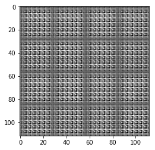
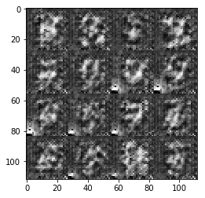
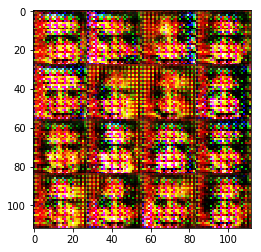
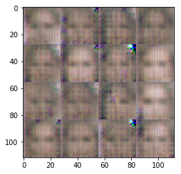

# Face Generation
In this project, you'll use generative adversarial networks to generate new images of faces.
### Get the Data
You'll be using two datasets in this project:
- MNIST
- CelebA

Since the celebA dataset is complex and you're doing GANs in a project for the first time, we want you to test your neural network on MNIST before CelebA.  Running the GANs on MNIST will allow you to see how well your model trains sooner.

If you're using [FloydHub](https://www.floydhub.com/), set `data_dir` to "/input" and use the [FloydHub data ID](http://docs.floydhub.com/home/using_datasets/) "R5KrjnANiKVhLWAkpXhNBe".


```python
data_dir = './data'

# FloydHub - Use with data ID "R5KrjnANiKVhLWAkpXhNBe"
#data_dir = '/input'


"""
DON'T MODIFY ANYTHING IN THIS CELL
"""
import helper

helper.download_extract('mnist', data_dir)
helper.download_extract('celeba', data_dir)
```

    Downloading mnist: 9.92MB [00:10, 987KB/s]                             
    Extracting mnist: 100%|██████████| 60.0K/60.0K [00:07<00:00, 8.37KFile/s]
    Downloading celeba: 1.44GB [29:23, 819KB/s]                            


    Extracting celeba...


## Explore the Data
### MNIST
As you're aware, the [MNIST](http://yann.lecun.com/exdb/mnist/) dataset contains images of handwritten digits. You can view the first number of examples by changing `show_n_images`. 


```python
import helper

show_n_images = 25
data_dir = './data'

"""
DON'T MODIFY ANYTHING IN THIS CELL
"""
%matplotlib inline
import os
from glob import glob
from matplotlib import pyplot

mnist_images = helper.get_batch(glob(os.path.join(data_dir, 'mnist/*.jpg'))[:show_n_images], 28, 28, 'L')
pyplot.imshow(helper.images_square_grid(mnist_images, 'L'), cmap='gray')
```


    <matplotlib.image.AxesImage at 0x1a92bd3d3c8>


### CelebA
The [CelebFaces Attributes Dataset (CelebA)](http://mmlab.ie.cuhk.edu.hk/projects/CelebA.html) dataset contains over 200,000 celebrity images with annotations.  Since you're going to be generating faces, you won't need the annotations.  You can view the first number of examples by changing `show_n_images`.


```python
show_n_images = 25

"""
DON'T MODIFY ANYTHING IN THIS CELL
"""
mnist_images = helper.get_batch(glob(os.path.join(data_dir, 'img_align_celeba/*.jpg'))[:show_n_images], 28, 28, 'RGB')
pyplot.imshow(helper.images_square_grid(mnist_images, 'RGB'))
```


    <matplotlib.image.AxesImage at 0x1a92bde5eb8>


## Preprocess the Data
Since the project's main focus is on building the GANs, we'll preprocess the data for you.  The values of the MNIST and CelebA dataset will be in the range of -0.5 to 0.5 of 28x28 dimensional images.  The CelebA images will be cropped to remove parts of the image that don't include a face, then resized down to 28x28.

The MNIST images are black and white images with a single [color channel](https://en.wikipedia.org/wiki/Channel_(digital_image%29) while the CelebA images have [3 color channels (RGB color channel)](https://en.wikipedia.org/wiki/Channel_(digital_image%29#RGB_Images).
## Build the Neural Network
You'll build the components necessary to build a GANs by implementing the following functions below:
- `model_inputs`
- `discriminator`
- `generator`
- `model_loss`
- `model_opt`
- `train`

### Check the Version of TensorFlow and Access to GPU
This will check to make sure you have the correct version of TensorFlow and access to a GPU


```python
"""
DON'T MODIFY ANYTHING IN THIS CELL
"""
from distutils.version import LooseVersion
import warnings
import tensorflow as tf

# Check TensorFlow Version
assert LooseVersion(tf.__version__) >= LooseVersion('1.0'), 'Please use TensorFlow version 1.0 or newer.  You are using {}'.format(tf.__version__)
print('TensorFlow Version: {}'.format(tf.__version__))

# Check for a GPU
if not tf.test.gpu_device_name():
    warnings.warn('No GPU found. Please use a GPU to train your neural network.')
else:
    print('Default GPU Device: {}'.format(tf.test.gpu_device_name()))
```

    TensorFlow Version: 1.2.1


    C:\Users\Kurosaki-X\Anaconda3\envs\dlnd-tf-lab\lib\site-packages\ipykernel\__main__.py:14: UserWarning: No GPU found. Please use a GPU to train your neural network.


### Input
Implement the `model_inputs` function to create TF Placeholders for the Neural Network. It should create the following placeholders:
- Real input images placeholder with rank 4 using `image_width`, `image_height`, and `image_channels`.
- Z input placeholder with rank 2 using `z_dim`.
- Learning rate placeholder with rank 0.

Return the placeholders in the following the tuple (tensor of real input images, tensor of z data)


```python
import problem_unittests as tests

def model_inputs(image_width, image_height, image_channels, z_dim):
    """
    Create the model inputs
    :param image_width: The input image width
    :param image_height: The input image height
    :param image_channels: The number of image channels
    :param z_dim: The dimension of Z
    :return: Tuple of (tensor of real input images, tensor of z data, learning rate)
    """
    real_input = tf.placeholder(tf.float32, [None, image_height, image_width, image_channels], name='real_input')
    z_input = tf.placeholder(tf.float32, [None, z_dim], name='z_input')
    learning_rate = tf.placeholder(tf.float32, name='learning_rate', shape=())
    
    return real_input, z_input, learning_rate


"""
DON'T MODIFY ANYTHING IN THIS CELL THAT IS BELOW THIS LINE
"""
tests.test_model_inputs(model_inputs)
```

    Tests Passed


### Discriminator
Implement `discriminator` to create a discriminator neural network that discriminates on `images`.  This function should be able to reuse the variables in the neural network.  Use [`tf.variable_scope`](https://www.tensorflow.org/api_docs/python/tf/variable_scope) with a scope name of "discriminator" to allow the variables to be reused.  The function should return a tuple of (tensor output of the discriminator, tensor logits of the discriminator).


```python
def discriminator(images, reuse=False, alpha=0.2):
    """
    Create the discriminator network
    :param images: Tensor of input image(s)
    :param reuse: Boolean if the weights should be reused
    :return: Tuple of (tensor output of the discriminator, tensor logits of the discriminator)
    """
    #https://medium.com/towards-data-science/gan-by-example-using-keras-on-tensorflow-backend-1a6d515a60d0
    with tf.variable_scope("discriminator", reuse=reuse):
        out1 = tf.layers.conv2d(images, 64, 5, strides=2, padding='SAME')
        relu1 = tf.maximum(alpha * out1, out1)
        drop1 = tf.layers.dropout(relu1, rate=0.4)
        
        out2 = tf.layers.conv2d(drop1, 128, 5, strides=2, padding='SAME')
        norm2 = tf.layers.batch_normalization(out2, training=True)
        relu2 = tf.maximum(alpha * norm2, norm2)
        drop2 = tf.layers.dropout(relu2, rate=0.4)
        
        out3 = tf.layers.conv2d(drop2, 256, 5, strides=2, padding='SAME')
        norm3 = tf.layers.batch_normalization(out3, training=True)
        relu3 = tf.maximum(alpha * norm3, norm3)
        drop3 = tf.layers.dropout(relu3, rate=0.4)
        
        flat = tf.reshape(drop3, (-1, 4*4*256))
        logits = tf.layers.dense(flat, 1)
        output = tf.sigmoid(logits)

    return output, logits


"""
DON'T MODIFY ANYTHING IN THIS CELL THAT IS BELOW THIS LINE
"""
tests.test_discriminator(discriminator, tf)
```

    Tests Passed


### Generator
Implement `generator` to generate an image using `z`. This function should be able to reuse the variables in the neural network.  Use [`tf.variable_scope`](https://www.tensorflow.org/api_docs/python/tf/variable_scope) with a scope name of "generator" to allow the variables to be reused. The function should return the generated 28 x 28 x `out_channel_dim` images.


```python
def generator(z, out_channel_dim, is_train=True, alpha=0.2):
    """
    Create the generator network
    :param z: Input z
    :param out_channel_dim: The number of channels in the output image
    :param is_train: Boolean if generator is being used for training
    :return: The tensor output of the generator
    """
    #https://medium.com/towards-data-science/gan-by-example-using-keras-on-tensorflow-backend-1a6d515a60d0
    reuse = not is_train
    
    with tf.variable_scope("generator", reuse=reuse):
        out1 = tf.layers.dense(z, 7*7*512)
        
        out1 = tf.reshape(out1, (-1, 7, 7, 512))
        norm1 = tf.layers.batch_normalization(out1, training=is_train, momentum=0.9)
        relu1 = tf.maximum(alpha * norm1, norm1)
        drop1 = tf.layers.dropout(relu1)
        
        out2 = tf.layers.conv2d_transpose(drop1, 256, 5, strides=2, padding='SAME')
        norm2 = tf.layers.batch_normalization(out2, training=is_train, momentum=0.9)
        relu2 = tf.maximum(alpha * norm2, norm2)

        out3 = tf.layers.conv2d_transpose(relu2, 128, 5, strides=2, padding='SAME')
        norm3 = tf.layers.batch_normalization(out3, training=is_train, momentum=0.9)
        relu3 = tf.maximum(alpha * norm3, norm3)
        
        logits = tf.layers.conv2d_transpose(relu3, out_channel_dim, 5, strides=1, padding='SAME')
        output = tf.tanh(logits)
        
    return output


"""
DON'T MODIFY ANYTHING IN THIS CELL THAT IS BELOW THIS LINE
"""
tests.test_generator(generator, tf)
```

    Tests Passed


### Loss
Implement `model_loss` to build the GANs for training and calculate the loss.  The function should return a tuple of (discriminator loss, generator loss).  Use the following functions you implemented:
- `discriminator(images, reuse=False)`
- `generator(z, out_channel_dim, is_train=True)`


```python
def model_loss(input_real, input_z, out_channel_dim):
    """
    Get the loss for the discriminator and generator
    :param input_real: Images from the real dataset
    :param input_z: Z input
    :param out_channel_dim: The number of channels in the output image
    :return: A tuple of (discriminator loss, generator loss)
    """
    #base on DCGAN.ipynb
    ger_model = generator(input_z, out_channel_dim)
    dis_model_real, dis_logits_real = discriminator(input_real)
    dis_model_fake, dis_logits_fake = discriminator(ger_model, reuse=True)
    
    dis_loss_real = tf.reduce_mean(
        tf.nn.sigmoid_cross_entropy_with_logits(logits=dis_logits_real, labels=tf.ones_like(dis_model_real) * 0.9))
    dis_loss_fake = tf.reduce_mean(
        tf.nn.sigmoid_cross_entropy_with_logits(logits=dis_logits_fake, labels=tf.zeros_like(dis_model_fake)))
    ger_loss = tf.reduce_mean(
        tf.nn.sigmoid_cross_entropy_with_logits(logits=dis_logits_fake, labels=tf.ones_like(dis_model_fake)))
    
    dis_loss = dis_loss_real + dis_loss_fake
    
    return dis_loss, ger_loss


"""
DON'T MODIFY ANYTHING IN THIS CELL THAT IS BELOW THIS LINE
"""
tests.test_model_loss(model_loss)
```

    Tests Passed


### Optimization
Implement `model_opt` to create the optimization operations for the GANs. Use [`tf.trainable_variables`](https://www.tensorflow.org/api_docs/python/tf/trainable_variables) to get all the trainable variables.  Filter the variables with names that are in the discriminator and generator scope names.  The function should return a tuple of (discriminator training operation, generator training operation).


```python
def model_opt(d_loss, g_loss, learning_rate, beta1):
    """
    Get optimization operations
    :param d_loss: Discriminator loss Tensor
    :param g_loss: Generator loss Tensor
    :param learning_rate: Learning Rate Placeholder
    :param beta1: The exponential decay rate for the 1st moment in the optimizer
    :return: A tuple of (discriminator training operation, generator training operation)
    """
    with tf.control_dependencies(tf.get_collection(tf.GraphKeys.UPDATE_OPS)):
        train_vars = tf.trainable_variables()
        
        dis_vars = [var for var in train_vars if var.name.startswith("discriminator")]
        ger_vars = [var for var in train_vars if var.name.startswith("generator")]

        dis_train = tf.train.AdamOptimizer(learning_rate, beta1=beta1).minimize(d_loss, var_list=dis_vars)
        ger_train = tf.train.AdamOptimizer(learning_rate, beta1=beta1).minimize(g_loss, var_list=ger_vars)
        
    return dis_train, ger_train


"""
DON'T MODIFY ANYTHING IN THIS CELL THAT IS BELOW THIS LINE
"""
tests.test_model_opt(model_opt, tf)
```

    Tests Passed


## Neural Network Training
### Show Output
Use this function to show the current output of the generator during training. It will help you determine how well the GANs is training.


```python
"""
DON'T MODIFY ANYTHING IN THIS CELL
"""
import numpy as np

def show_generator_output(sess, n_images, input_z, out_channel_dim, image_mode):
    """
    Show example output for the generator
    :param sess: TensorFlow session
    :param n_images: Number of Images to display
    :param input_z: Input Z Tensor
    :param out_channel_dim: The number of channels in the output image
    :param image_mode: The mode to use for images ("RGB" or "L")
    """
    cmap = None if image_mode == 'RGB' else 'gray'
    z_dim = input_z.get_shape().as_list()[-1]
    example_z = np.random.uniform(-1, 1, size=[n_images, z_dim])

    samples = sess.run(
        generator(input_z, out_channel_dim, False),
        feed_dict={input_z: example_z})

    images_grid = helper.images_square_grid(samples, image_mode)
    pyplot.imshow(images_grid, cmap=cmap)
    pyplot.show()
```

### Train
Implement `train` to build and train the GANs.  Use the following functions you implemented:
- `model_inputs(image_width, image_height, image_channels, z_dim)`
- `model_loss(input_real, input_z, out_channel_dim)`
- `model_opt(d_loss, g_loss, learning_rate, beta1)`

Use the `show_generator_output` to show `generator` output while you train. Running `show_generator_output` for every batch will drastically increase training time and increase the size of the notebook.  It's recommended to print the `generator` output every 100 batches.


```python
def train(epoch_count, batch_size, z_dim, learning_rate, beta1, get_batches, data_shape, data_image_mode):
    """
    Train the GAN
    :param epoch_count: Number of epochs
    :param batch_size: Batch Size
    :param z_dim: Z dimension
    :param learning_rate: Learning Rate
    :param beta1: The exponential decay rate for the 1st moment in the optimizer
    :param get_batches: Function to get batches
    :param data_shape: Shape of the data
    :param data_image_mode: The image mode to use for images ("RGB" or "L")
    """
    #based on DCGAN.ipynb
    output_channel_dim = data_shape[3]
    real_input, z_input, tf_learnrate = model_inputs(data_shape[1], data_shape[2], output_channel_dim, z_dim)
    d_loss, g_loss = model_loss(real_input, z_input, output_channel_dim)
    dis_train, ger_train = model_opt(d_loss, g_loss, learning_rate, beta1)
    
    with tf.Session() as sess:
        sess.run(tf.global_variables_initializer())
        for epoch_i in range(epoch_count):
            for step, batch_images in enumerate(get_batches(batch_size)):
                
                batch_z = np.random.uniform(-1, 1, size=(batch_size, z_dim))
                _ = sess.run(dis_train, feed_dict={real_input: batch_images, z_input: batch_z, tf_learnrate: learning_rate})
                _ = sess.run(ger_train, feed_dict={z_input: batch_z, real_input: batch_images, tf_learnrate: learning_rate})
                
                if step % 10 == 0:
                    train_loss_dis = d_loss.eval({z_input: batch_z, real_input: batch_images})
                    train_loss_ger = g_loss.eval({z_input: batch_z})
                
                    print("Epoch {}/{}...".format(epoch_i+1, epochs),
                          "Discriminator Loss: {:.4f}...".format(train_loss_dis),
                          "Generator Loss: {:.4f}".format(train_loss_ger))
                
                if step % 100 == 0:
                    show_generator_output(sess, 4, z_input, output_channel_dim, data_image_mode)
                    
```

### MNIST
Test your GANs architecture on MNIST.  After 2 epochs, the GANs should be able to generate images that look like handwritten digits.  Make sure the loss of the generator is lower than the loss of the discriminator or close to 0.


```python
batch_size = 128
z_dim = 120
learning_rate = 0.001
beta1 = 0.4

"""
DON'T MODIFY ANYTHING IN THIS CELL THAT IS BELOW THIS LINE
"""
epochs = 2

mnist_dataset = helper.Dataset('mnist', glob(os.path.join(data_dir, 'mnist/*.jpg')))
with tf.Graph().as_default():
    train(epochs, batch_size, z_dim, learning_rate, beta1, mnist_dataset.get_batches,
          mnist_dataset.shape, mnist_dataset.image_mode)
```

    Epoch 1/2... Discriminator Loss: 11.8370... Generator Loss: 0.0001





    Epoch 1/2... Discriminator Loss: 0.8647... Generator Loss: 26.3647
    Epoch 1/2... Discriminator Loss: 8.3151... Generator Loss: 0.0579
    Epoch 1/2... Discriminator Loss: 0.9366... Generator Loss: 1.4380
    Epoch 1/2... Discriminator Loss: 1.8322... Generator Loss: 0.3555
    Epoch 1/2... Discriminator Loss: 0.8304... Generator Loss: 1.5236
    Epoch 1/2... Discriminator Loss: 1.1217... Generator Loss: 0.9041
    Epoch 1/2... Discriminator Loss: 1.4588... Generator Loss: 3.2253
    Epoch 1/2... Discriminator Loss: 0.8252... Generator Loss: 1.1052
    Epoch 1/2... Discriminator Loss: 0.4212... Generator Loss: 2.8431
    Epoch 1/2... Discriminator Loss: 0.3518... Generator Loss: 5.2515


    Epoch 1/2... Discriminator Loss: 2.4170... Generator Loss: 7.1168
    Epoch 1/2... Discriminator Loss: 0.8495... Generator Loss: 1.3166
    Epoch 1/2... Discriminator Loss: 0.4462... Generator Loss: 2.5325
    Epoch 1/2... Discriminator Loss: 0.3791... Generator Loss: 3.4950
    Epoch 1/2... Discriminator Loss: 0.3460... Generator Loss: 6.1778
    Epoch 1/2... Discriminator Loss: 0.3808... Generator Loss: 3.5601
    Epoch 1/2... Discriminator Loss: 0.8963... Generator Loss: 4.8574
    Epoch 1/2... Discriminator Loss: 0.9800... Generator Loss: 0.8076
    Epoch 1/2... Discriminator Loss: 0.5530... Generator Loss: 2.5139
    Epoch 1/2... Discriminator Loss: 0.5662... Generator Loss: 1.8427


    Epoch 1/2... Discriminator Loss: 0.3492... Generator Loss: 4.4839
    Epoch 1/2... Discriminator Loss: 0.4226... Generator Loss: 2.8311
    Epoch 1/2... Discriminator Loss: 3.1606... Generator Loss: 6.9094
    Epoch 1/2... Discriminator Loss: 0.4218... Generator Loss: 3.0067
    Epoch 1/2... Discriminator Loss: 0.6636... Generator Loss: 1.3708
    Epoch 1/2... Discriminator Loss: 0.5645... Generator Loss: 1.7322
    Epoch 1/2... Discriminator Loss: 0.4086... Generator Loss: 3.8617
    Epoch 1/2... Discriminator Loss: 0.3928... Generator Loss: 4.2463
    Epoch 1/2... Discriminator Loss: 0.3414... Generator Loss: 6.1110
    Epoch 1/2... Discriminator Loss: 4.1770... Generator Loss: 0.0712


    Epoch 1/2... Discriminator Loss: 1.7765... Generator Loss: 3.1521
    Epoch 1/2... Discriminator Loss: 1.3853... Generator Loss: 0.5703
    Epoch 1/2... Discriminator Loss: 0.5913... Generator Loss: 2.3212
    Epoch 1/2... Discriminator Loss: 0.5380... Generator Loss: 2.6542
    Epoch 1/2... Discriminator Loss: 2.1109... Generator Loss: 0.2405
    Epoch 1/2... Discriminator Loss: 0.5940... Generator Loss: 4.5775
    Epoch 1/2... Discriminator Loss: 0.3941... Generator Loss: 4.6149
    Epoch 1/2... Discriminator Loss: 0.4564... Generator Loss: 3.8206
    Epoch 1/2... Discriminator Loss: 0.4259... Generator Loss: 3.3738
    Epoch 1/2... Discriminator Loss: 1.1610... Generator Loss: 1.5208


    Epoch 1/2... Discriminator Loss: 0.4282... Generator Loss: 4.0576
    Epoch 1/2... Discriminator Loss: 0.3708... Generator Loss: 4.3515
    Epoch 1/2... Discriminator Loss: 0.4569... Generator Loss: 2.8301
    Epoch 1/2... Discriminator Loss: 2.2155... Generator Loss: 0.2506
    Epoch 1/2... Discriminator Loss: 0.6263... Generator Loss: 2.0400
    Epoch 1/2... Discriminator Loss: 1.5072... Generator Loss: 0.6393
    Epoch 2/2... Discriminator Loss: 1.2676... Generator Loss: 2.3847


    Epoch 2/2... Discriminator Loss: 0.9597... Generator Loss: 2.1580
    Epoch 2/2... Discriminator Loss: 0.5653... Generator Loss: 2.3676
    Epoch 2/2... Discriminator Loss: 0.3898... Generator Loss: 5.1062
    Epoch 2/2... Discriminator Loss: 0.3861... Generator Loss: 4.3649
    Epoch 2/2... Discriminator Loss: 0.4083... Generator Loss: 3.8503
    Epoch 2/2... Discriminator Loss: 0.3727... Generator Loss: 4.7533
    Epoch 2/2... Discriminator Loss: 0.3804... Generator Loss: 4.6765
    Epoch 2/2... Discriminator Loss: 0.5426... Generator Loss: 3.1223
    Epoch 2/2... Discriminator Loss: 0.3509... Generator Loss: 5.2767
    Epoch 2/2... Discriminator Loss: 0.4217... Generator Loss: 6.9401





    Epoch 2/2... Discriminator Loss: 0.3684... Generator Loss: 4.4417
    Epoch 2/2... Discriminator Loss: 1.9355... Generator Loss: 2.1470
    Epoch 2/2... Discriminator Loss: 1.1147... Generator Loss: 0.8954
    Epoch 2/2... Discriminator Loss: 1.0721... Generator Loss: 0.8797
    Epoch 2/2... Discriminator Loss: 0.9526... Generator Loss: 2.1036
    Epoch 2/2... Discriminator Loss: 1.1211... Generator Loss: 2.9804
    Epoch 2/2... Discriminator Loss: 0.7303... Generator Loss: 2.9150
    Epoch 2/2... Discriminator Loss: 0.4167... Generator Loss: 3.5916
    Epoch 2/2... Discriminator Loss: 0.4143... Generator Loss: 4.2853
    Epoch 2/2... Discriminator Loss: 0.3731... Generator Loss: 4.5408


    Epoch 2/2... Discriminator Loss: 0.3910... Generator Loss: 3.9159
    Epoch 2/2... Discriminator Loss: 0.4179... Generator Loss: 3.7185
    Epoch 2/2... Discriminator Loss: 2.8947... Generator Loss: 0.4036
    Epoch 2/2... Discriminator Loss: 0.5240... Generator Loss: 3.9034
    Epoch 2/2... Discriminator Loss: 0.4936... Generator Loss: 2.6303
    Epoch 2/2... Discriminator Loss: 0.6345... Generator Loss: 1.7837
    Epoch 2/2... Discriminator Loss: 2.0412... Generator Loss: 0.2802
    Epoch 2/2... Discriminator Loss: 1.5294... Generator Loss: 0.4699
    Epoch 2/2... Discriminator Loss: 1.3075... Generator Loss: 0.6295
    Epoch 2/2... Discriminator Loss: 0.4208... Generator Loss: 3.4158


    Epoch 2/2... Discriminator Loss: 0.5323... Generator Loss: 1.9458
    Epoch 2/2... Discriminator Loss: 0.4567... Generator Loss: 2.3985
    Epoch 2/2... Discriminator Loss: 0.9555... Generator Loss: 0.9699
    Epoch 2/2... Discriminator Loss: 0.8081... Generator Loss: 1.6800
    Epoch 2/2... Discriminator Loss: 0.5114... Generator Loss: 2.3258
    Epoch 2/2... Discriminator Loss: 0.4673... Generator Loss: 2.3078
    Epoch 2/2... Discriminator Loss: 1.3339... Generator Loss: 0.5330
    Epoch 2/2... Discriminator Loss: 0.4813... Generator Loss: 2.2131
    Epoch 2/2... Discriminator Loss: 0.4486... Generator Loss: 2.4055
    Epoch 2/2... Discriminator Loss: 1.4540... Generator Loss: 0.6321


    Epoch 2/2... Discriminator Loss: 2.6707... Generator Loss: 0.1429
    Epoch 2/2... Discriminator Loss: 0.8888... Generator Loss: 1.0742
    Epoch 2/2... Discriminator Loss: 1.8030... Generator Loss: 0.3188
    Epoch 2/2... Discriminator Loss: 0.6668... Generator Loss: 3.5392
    Epoch 2/2... Discriminator Loss: 1.7560... Generator Loss: 0.3169
    Epoch 2/2... Discriminator Loss: 0.7312... Generator Loss: 1.4624


### CelebA
Run your GANs on CelebA.  It will take around 20 minutes on the average GPU to run one epoch.  You can run the whole epoch or stop when it starts to generate realistic faces.


```python
batch_size = 128
z_dim = 120
learning_rate = 0.001
beta1 = 0.4

"""
DON'T MODIFY ANYTHING IN THIS CELL THAT IS BELOW THIS LINE
"""
epochs = 1

celeba_dataset = helper.Dataset('celeba', glob(os.path.join(data_dir, 'img_align_celeba/*.jpg')))
with tf.Graph().as_default():
    train(epochs, batch_size, z_dim, learning_rate, beta1, celeba_dataset.get_batches,
          celeba_dataset.shape, celeba_dataset.image_mode)
```

    Epoch 1/1... Discriminator Loss: 16.9941... Generator Loss: 0.0000


    Epoch 1/1... Discriminator Loss: 4.1162... Generator Loss: 0.0350
    Epoch 1/1... Discriminator Loss: 0.5162... Generator Loss: 2.8422
    Epoch 1/1... Discriminator Loss: 0.4747... Generator Loss: 3.1210
    Epoch 1/1... Discriminator Loss: 1.0745... Generator Loss: 0.9649
    Epoch 1/1... Discriminator Loss: 1.2533... Generator Loss: 3.5242
    Epoch 1/1... Discriminator Loss: 0.8090... Generator Loss: 1.3331
    Epoch 1/1... Discriminator Loss: 0.4544... Generator Loss: 3.6281
    Epoch 1/1... Discriminator Loss: 0.4184... Generator Loss: 3.3658
    Epoch 1/1... Discriminator Loss: 0.3670... Generator Loss: 8.1484
    Epoch 1/1... Discriminator Loss: 0.4078... Generator Loss: 3.3341





    Epoch 1/1... Discriminator Loss: 0.6075... Generator Loss: 2.8589
    Epoch 1/1... Discriminator Loss: 0.4826... Generator Loss: 2.3719
    Epoch 1/1... Discriminator Loss: 0.5918... Generator Loss: 2.2987
    Epoch 1/1... Discriminator Loss: 0.6381... Generator Loss: 2.7862
    Epoch 1/1... Discriminator Loss: 0.4676... Generator Loss: 2.5488
    Epoch 1/1... Discriminator Loss: 0.3475... Generator Loss: 6.2478
    Epoch 1/1... Discriminator Loss: 1.0216... Generator Loss: 1.3938
    Epoch 1/1... Discriminator Loss: 0.5664... Generator Loss: 1.8657
    Epoch 1/1... Discriminator Loss: 0.8482... Generator Loss: 1.4416
    Epoch 1/1... Discriminator Loss: 0.6480... Generator Loss: 1.8466


    Epoch 1/1... Discriminator Loss: 2.2491... Generator Loss: 0.2642
    Epoch 1/1... Discriminator Loss: 0.7588... Generator Loss: 1.3423
    Epoch 1/1... Discriminator Loss: 0.5766... Generator Loss: 3.1370
    Epoch 1/1... Discriminator Loss: 1.9425... Generator Loss: 0.4048
    Epoch 1/1... Discriminator Loss: 1.1857... Generator Loss: 0.9992
    Epoch 1/1... Discriminator Loss: 1.5598... Generator Loss: 0.7427
    Epoch 1/1... Discriminator Loss: 1.2919... Generator Loss: 1.2880
    Epoch 1/1... Discriminator Loss: 1.3161... Generator Loss: 2.0889
    Epoch 1/1... Discriminator Loss: 0.5954... Generator Loss: 2.0027
    Epoch 1/1... Discriminator Loss: 0.8830... Generator Loss: 1.2181


    Epoch 1/1... Discriminator Loss: 0.5983... Generator Loss: 1.9686
    Epoch 1/1... Discriminator Loss: 3.3128... Generator Loss: 7.1442
    Epoch 1/1... Discriminator Loss: 0.5201... Generator Loss: 2.1857
    Epoch 1/1... Discriminator Loss: 0.9608... Generator Loss: 1.5807
    Epoch 1/1... Discriminator Loss: 5.2778... Generator Loss: 2.8808
    Epoch 1/1... Discriminator Loss: 1.2259... Generator Loss: 1.0814
    Epoch 1/1... Discriminator Loss: 1.0846... Generator Loss: 1.0706
    Epoch 1/1... Discriminator Loss: 1.2432... Generator Loss: 1.0470
    Epoch 1/1... Discriminator Loss: 0.9312... Generator Loss: 1.2703
    Epoch 1/1... Discriminator Loss: 0.4814... Generator Loss: 2.8450


    Epoch 1/1... Discriminator Loss: 0.4566... Generator Loss: 3.3208
    Epoch 1/1... Discriminator Loss: 1.4454... Generator Loss: 1.1703
    Epoch 1/1... Discriminator Loss: 0.9391... Generator Loss: 1.4574
    Epoch 1/1... Discriminator Loss: 0.9250... Generator Loss: 1.2871
    Epoch 1/1... Discriminator Loss: 0.7125... Generator Loss: 1.6204
    Epoch 1/1... Discriminator Loss: 1.1140... Generator Loss: 4.0918
    Epoch 1/1... Discriminator Loss: 1.0832... Generator Loss: 1.2038
    Epoch 1/1... Discriminator Loss: 0.8608... Generator Loss: 2.3076
    Epoch 1/1... Discriminator Loss: 0.4794... Generator Loss: 2.3596
    Epoch 1/1... Discriminator Loss: 0.4563... Generator Loss: 3.5339





    Epoch 1/1... Discriminator Loss: 1.0030... Generator Loss: 1.1396
    Epoch 1/1... Discriminator Loss: 0.7648... Generator Loss: 2.0937
    Epoch 1/1... Discriminator Loss: 0.4759... Generator Loss: 2.5067
    Epoch 1/1... Discriminator Loss: 0.5335... Generator Loss: 2.1120
    Epoch 1/1... Discriminator Loss: 0.4425... Generator Loss: 2.9939
    Epoch 1/1... Discriminator Loss: 0.5095... Generator Loss: 3.4753
    Epoch 1/1... Discriminator Loss: 0.5195... Generator Loss: 2.1756
    Epoch 1/1... Discriminator Loss: 0.5305... Generator Loss: 2.6773
    Epoch 1/1... Discriminator Loss: 0.4184... Generator Loss: 3.5996
    Epoch 1/1... Discriminator Loss: 0.9422... Generator Loss: 2.3405


    Epoch 1/1... Discriminator Loss: 1.0512... Generator Loss: 3.3225
    Epoch 1/1... Discriminator Loss: 0.4752... Generator Loss: 2.5340
    Epoch 1/1... Discriminator Loss: 0.4263... Generator Loss: 3.2993
    Epoch 1/1... Discriminator Loss: 0.4512... Generator Loss: 2.8712
    Epoch 1/1... Discriminator Loss: 0.3626... Generator Loss: 4.7991
    Epoch 1/1... Discriminator Loss: 1.1171... Generator Loss: 1.0248
    Epoch 1/1... Discriminator Loss: 0.4038... Generator Loss: 3.7627
    Epoch 1/1... Discriminator Loss: 0.3863... Generator Loss: 3.9757
    Epoch 1/1... Discriminator Loss: 0.4133... Generator Loss: 3.2886
    Epoch 1/1... Discriminator Loss: 0.4156... Generator Loss: 3.1933


    Epoch 1/1... Discriminator Loss: 0.3760... Generator Loss: 4.7054
    Epoch 1/1... Discriminator Loss: 0.9805... Generator Loss: 4.1193
    Epoch 1/1... Discriminator Loss: 0.4106... Generator Loss: 3.0476
    Epoch 1/1... Discriminator Loss: 0.5004... Generator Loss: 2.2198
    Epoch 1/1... Discriminator Loss: 0.3734... Generator Loss: 4.3040
    Epoch 1/1... Discriminator Loss: 1.7771... Generator Loss: 7.0367
    Epoch 1/1... Discriminator Loss: 1.4334... Generator Loss: 1.6699
    Epoch 1/1... Discriminator Loss: 1.0360... Generator Loss: 1.1726
    Epoch 1/1... Discriminator Loss: 0.5911... Generator Loss: 2.1622


### Submitting This Project
When submitting this project, make sure to run all the cells before saving the notebook. Save the notebook file as "dlnd_face_generation.ipynb" and save it as a HTML file under "File" -> "Download as". Include the "helper.py" and "problem_unittests.py" files in your submission.
